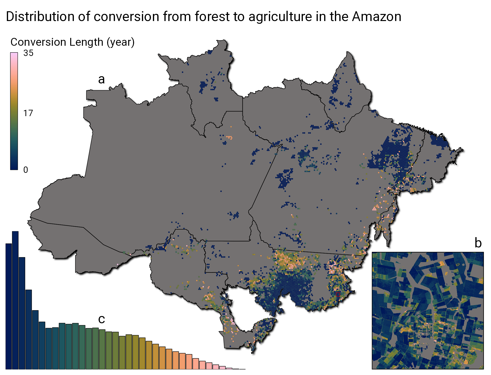
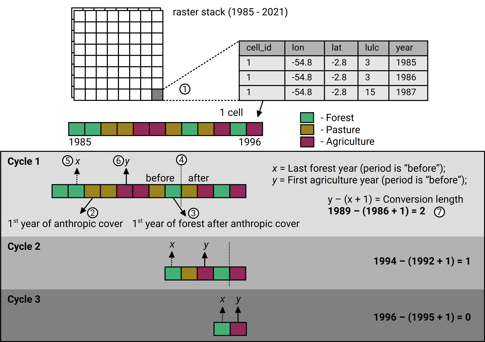
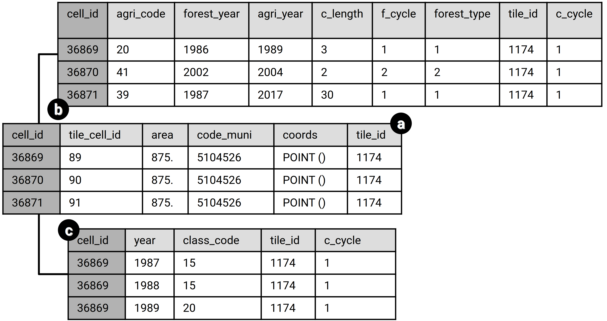

# Conversion from forest to agriculture in the Brazilian Amazon from 1985 to 2021

## Background

In the last decades, the Amazon biome have been submitted to strong changes, the advance of agricultural areas over native forests is shaping a new landscape in the region.
The most common pattern of conversion from natural forest formations to agriculture sites, is the initial process of deforestation, followed by the establishment of pasture, where extensive livestock production takes place, until its replacement to agricultural activities.
This process can take several decades to be accomplished, or even less than one year, in which it may be considered as a direct conversion from forest to agriculture.

In this project, we took the opportunity to quantify the length of this conversion, by using data from a Land Cover and Land Use (LULC) classification from MapBiomas (Souza et al. 2020).
This project aims to characterize and quantify the length of the conversion from forest formations to agriculture in the Amazon.

In this document, we explain the methodology to calculate the length (in years) of forest to agriculture conversion in the Amazon biome, and also describe a possible approach to access and analyze the data.

## Methodology

### Downloading data

The data source of this project is the MapBiomas, which provides annual land cover classification from 1985 to 2021 (it gets updated each year), in a resolution of 30 meters.
The classification products can be directly assessed and processed in the Google Earth Engine (GEE) platform.

Due to the amount of data contained in the full collection of MapBiomas, only a subset of the data was downloaded to be used in the project.
To filter this subset, we first set the area of interest, which in this case is the whole extent of the Amazon biome region according to the Brazilian Institute of Geography and Statistics (IBGE).
After defining the area of interest, we generated three masks to filter the pixels of interest:

-   A water mask, extracted from the Global Surface Water product provided by the Copernicus Programme (Pekel et al. 2016);

-   An agriculture mask, derived from the MapBiomas data, which we filtered pixels that contains any occurrence of non natural class (the classes are specified in the configuration file), but not only these classes;

-   A forest mask, also derived from MapBiomas, which filter pixels which contains any occurrence of forest formation, but not only this class;

In this process, two different datasets are downloaded, one containing the LULC values from MapBiomas (named as mb_lulc...), and one containing the mask pixels and their respective areas (named as mb_mask).

To avoid problems when processing the downloaded raster files, the MapBiomas and the mask data are divided in multiple tiles by GEE.
These are saved to a Google Drive account and subsequently downloaded in the local disk (in the working directory).
The files follows the pattern **mb\_{variable}-{tile code}.tif** (e.g. mb_lulc-0000020480-0000069120.tif), and are saved to the path "./data/mb_raw_raster_tiles/".

### Extracting LULC conversion values

With the raster files saved in the local disk, we can start processing them to extract the conversion values to a tabular format.

But before that, we need to be sure that each pixel value extracted from the raster files are related to one unique **id**, to ensure that, we first convert all the "mb_mask" files to tables, and than bind them into a single table, assigning one **id** value for each unique combinations of coordinates (longitude, latitude).
This will serve as a look up table to set the correct id of each pixel in the next processes.

The steps to calculate the conversion values involves a sequence of iterations over each "mb_lulc" file, performing a series of filters, summaries and joins, in order to resolve the sequence of LULC classes along the years.
You can see the sequence of steps necessary to complete the task in this [flowchart](./figs/change_length_routine_flowchart.svg).

The logic behind the methodology is explained in the following steps:

1.  Load raster and extract valid values into a table;

2.  Calculate the year of first occurrence of a non-natural LULC class for each pixel;

3.  Calculate the first year of "Forest Formation" LULC class after the year calculated in step **2**, for each pixel;

4.  Classify rows as "before" or "after" the occurrence of the year calculated in step **3**, for each pixel;

5.  Calculate the last year of "Forest Formation" within the rows classified as "before", for each pixel;

6.  Calculate the first year of any agriculture type class within the rows classified as "before", for each pixel;

7.  Calculate the difference between years from items **5** and **6** to get the LULC conversion length in years, for each pixel;

The figure below illustrates the processes explained above when being applied in a single pixel.
Note that all values and scenarios are hypothetical.

The conversion length routine generates 3 types of tables as its final result.

1.  One is the table generated from the "mb_mask" raster, created before the process to calculate conversion values.
    It contains the spatial information (longitude, latitude) of each pixel and its unique id.
    It is named as "mask_cells.parquet";

2.  A table with conversion length values, which also presents the unique id (related to the table above), and other values as the first and last year of the conversion, the resulting agriculture type, and the number of the conversion cycle.
    It is named as "c_length.parquet";

3.  The last table are the LULC classes of all years within the conversion, and also the first 5 years after the conversion.
    It is named as "c_classes.parquet";

The resulting tables are described in the image below.
Note that all values are hypothetical.

### Storing the data

We chose two ways to store and share the data we generated in the section above.

-   One is to store the data from all three tables in three sets of Parquet files, in a structure of folders and sub folders;

-   The other is to convert the "trans_length.parquet" tables back to raster files.
    Raster files are useful to efficiently store spatial data, calculate areas, operate in relation to vector objects and perform data summaries, and it is also a very accessible format.
    However, it would be difficult to store data from "c_classes.parquet" due to its high complexity, so this information is not added to the raster files;

#### Parquet files

The Parquet is a column-oriented storage format, being more efficient than popular storage formats such as CSV, at the cost of accessibility (you can't open it in spreadsheet programs or as plain text).
However it can work with a large number of programming languages, such as Java, Python and R.
The structure of the Parquet data set is organized as the scheme below.

#### Raster files

The new raster files are created based on the tiles downloaded from GEE (which are in the path "./data/raw_raster_tiles/"), using their extent values and its number of rows and columns (located on the "./data/c_tabular_dataset/tiles_metadata.parquet" file).
For each tile file from "./data/raw_raster_tiles/", a set of new raster files are created based in the number of agriculture cycle ("agri_cycle") found in the tables, resulting in one raster for each agriculture cycle.
Each new raster file contains 6 bands:

-   **Band 1** = "agri_code" *(The agriculture class code that resulted from the conversion)*;
-   **Band 2** = "forest_year" *(The last forest year before the conversion, can be interpreted as the deforestation year)*;
-   **Band 3** = "agri_year" *(The first year of the agriculture establishment, being the end of the conversion)*;
-   **Band 4** = "c_length" *(The length in years of the conversion from forest to agriculture)*;
-   **Band 5** = "c_cycle" *(The number of the conversion cycle in which the conversion occurred)*;
-   **Band 6** = "forest_type" *(The type of the forest that suffered the conversion)*;

The new raster files are saved in the path "./data/c_raster_tiles/".

To facilitate the use of these new raster files, we also merged all the raster of each agriculture cycle into a single mosaic, which are saved in the path "./data/c_raster_mosaic/".

## Data description

The descriptive analysis were performed over the Parquet files.
To read and manipulate these files, we used the {sparklyr} package, which makes possible to read, query and summarize sets of parquet files that may be larger than the computer memory.
Here we employed the Spark locally, without the use of clusters.

An example of a result that can be obtained by this methodology is the figure below.
The code used to produce this and other figures can be visualized in this vignette.

## References

Pekel, Jean-François, Andrew Cottam, Noel Gorelick, and Alan S. Belward.
2016.
"High-Resolution Mapping of Global Surface Water and Its Long-Term Changes." Nature 540 (7633): 418--22.
<https://doi.org/10.1038/nature20584>.

Souza, Carlos M., Julia Z. Shimbo, Marcos R. Rosa, Leandro L. Parente, Ane A. Alencar, Bernardo F. T. Rudorff, Heinrich Hasenack, et al. 2020.
"Reconstructing Three Decades of Land Use and Land Cover Changes in Brazilian Biomes with Landsat Archive and Earth Engine." Remote Sensing 12 (17): 2735.
<https://doi.org/10.3390/rs12172735>.

------------------------------------------------------------------------

## Usage

To reproduce the codes of this repository, you will need to have R installed (we recommend version \>= 4.0.0).
You can check the R website (<https://www.r-project.org/>) to download the software, there is also a detailed guide to install and manage R (<https://cran.r-project.org/doc/manuals/r-release/R-admin.html>).
We also recommend using the Rstudio interface to run the codes, since it offers many facilities to interact with the code, you can check their website for download and installation steps (<https://rstudio.com/products/rstudio/download/>).

Our methodology also requires a set of packages to be reproduced (all of them are available on CRAN).
You can run the following code in the R console to install them all (although we recommend you to check the website of each before installation, and make the installation separately).
Check the description file to see the version of each package.

    install.packages(
      c(
        "dplyr", "forcats", "tibble", "tidyr", "readr", "magrittr", "purrr",
        "glue", "lubridate", "stringr", "ggplot2", "ggridges", "scales", "units",
        "arrow", "fs", "gdalUtilities", "geobr", "googledrive", "terra", "sf",
        "rgee", "geojsonio", "sparklyr", "shiny", "shinythemes", "gridlayout", "ggfx",
        "patchwork", "scico", "ggtext", "gt"
      )
    )

Most of the packages should be ready to be used after being installed with the function `install.packages()`, however, *rgee* and *sparklyr* requires additional steps, please check their homepages for more details (<https://github.com/r-spatial/rgee>, <https://spark.rstudio.com/>).

After installed all required packages, you have to download the repository to your local computer.
The project contains 6 routines in the "./scripts/" folder.
To reproduce the results of the project, you should run the scripts in the order displayed below.
It is possible to run the analysis after running scripts 01 to 03, the 04 and 05 are optional, and serve to transform the data back to raster format.

-   **01_download.R** - This code uses the Google Earth Engine API within R {rgee} to access and download Land Use and Land Cover (LULC) data in the Brazilian Amazon biome.
    The LULC data is provided by the MapBiomas project (<https://mapbiomas.org/en?cama_set_language=en>).
    In order to run this routine, you will need to have access to Google Earth Engine (<https://earthengine.google.com/>).
    You will also need to modify the "conf/config.R" file, just add your email inside the brackets in the gee_email option.

-   **02_extract_mask.R** - This code extracts area values of the mask raster files and its metadata.
    The process is applied in each file.
    The results are saved in .parquet format.

-   **03_extract_conversion.R** - This code extracts values of the conversion between Forest and Agriculture from MapBiomas raster files.
    The process is applied in each file, where a number of iterations are performed to extract values from different conversion cycles.
    The results are saved in .parquet format.

-   **04_rasterize.R** - This codes takes values from the "trans_length" dataset and metadata information to recreate raster tiles with the conversion values.
    The new raster files share the same spatial characteristics as the downloaded tiles (extent, resolution...) Each tile will be composed by a set of raster files, one file for each forest-agriculture conversion cycle, and the bands of the new files carry values of the variables stored in the parquet dataset.

-   **05_merge_raster.R** - This script merges the raster tiles created in the "03_rasterize.R" script into a single mosaic.
    Each mosaic is created for each forest-agriculture conversion cycle.

-   **06_validation_data.R** - This script downloads data for validation of the conversion results.

There is also a set of scripts in the "./scripts/figures/" directorie.
The objective of these routines is to explore the dataset by filtering and aggregating data in Spark.
Results are supposed to give us a overall view of the data by plots and tables.
In order to run this routine, you will need to successfully install and connect to Spark using the {sparklyr} package.

The project also contains a configuration file in the "./conf" folder.
You should check this file before start running the scripts to set the options in the most suitable way to reproduce the methodology.

## Known issues

-   When searching the googledrive files exported by GEE, it may not find all files in the driver folder, specially with a big number a files (avoid setting the tile_dim option lower than 1536 in the config.R file).
    This is an open issue that have not been addressed yet in the *googledrive* package.
    It seems that the problem is related to google itself.
    You can read about the issue here: <https://github.com/tidyverse/googledrive/issues/288>.
    In an attempt to avoid this problem, the code repeats the drive_ls functions some times and get the distinct files it have found, but this may not work every time.
    If you have problems downloading the files, please download them manually and extract the files altogether in the folder called "./data/raw_raster_tiles".

-   When running the 02_extract_mask.R, you may see an error being raised, something like "Error in (function (x) : attempt to apply non-function".
    This is a known issue, however the reasons for it are still unknown.
    You can ignore these error calls.
    Here is some links about this issue: <https://github.com/rspatial/terra/issues/30> and <https://github.com/sneumann/xcms/issues/288>

## License

### Code

The code in this repository, including all code samples in the notebooks, is released under the [GPL-3.0 license](LICENSE-CODE).
Read more at the [GNU Operating System](https://www.gnu.org/licenses/gpl-3.0.html).

### Text

The text content of this repository, including .rmd and html files, is released under the [CC BY 4.0 license](LICENSE-TEXT).
Read more at [Creative Commons](https://creativecommons.org/licenses/by/4.0/legalcode).

### Data

The data content of this repository, including .csv spreadsheets, html tables and other tabular formats, is released under the [CC BY 4.0 license](LICENSE-DATA).
Read more at [Creative Commons](https://creativecommons.org/licenses/by/4.0/legalcode).

------------------------------------------------------------------------
