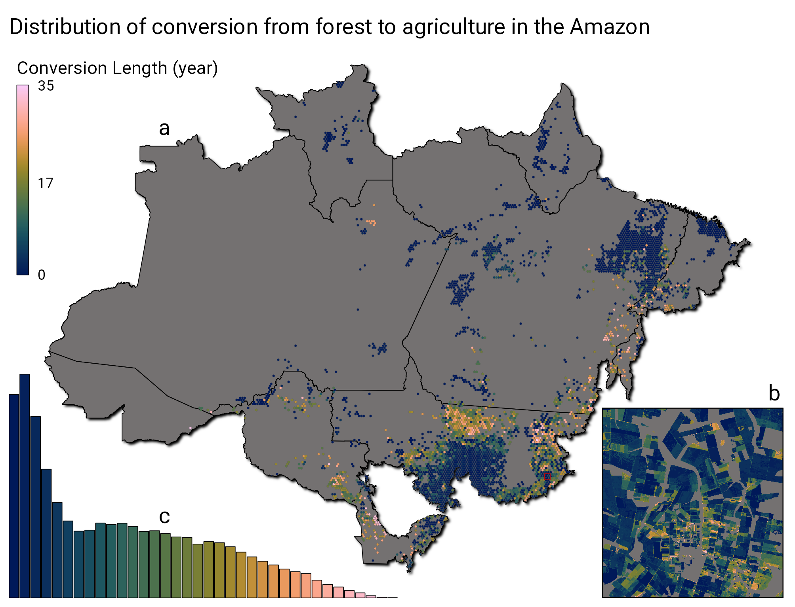
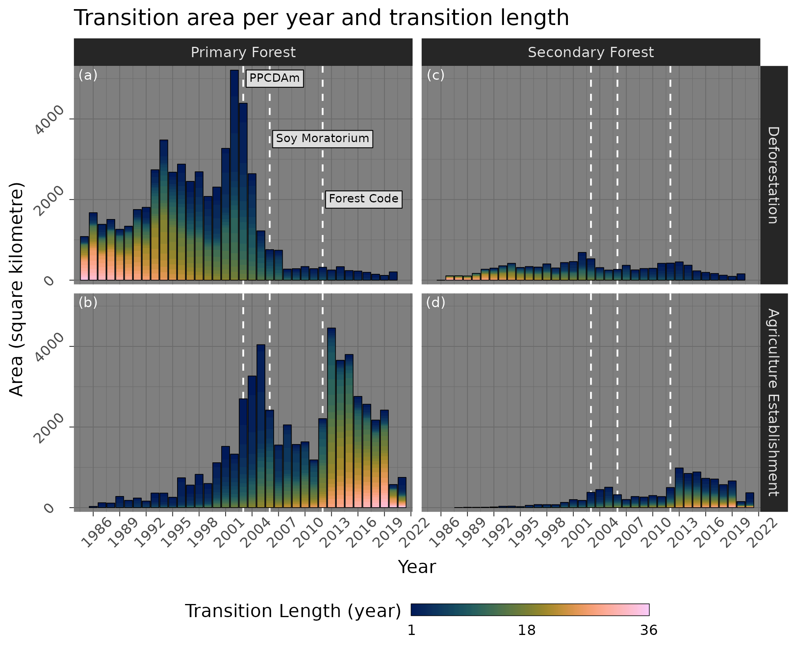
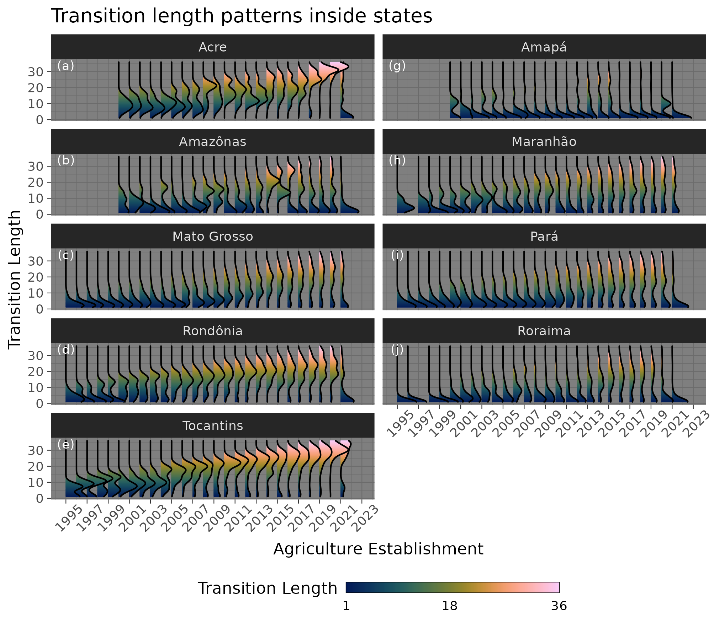
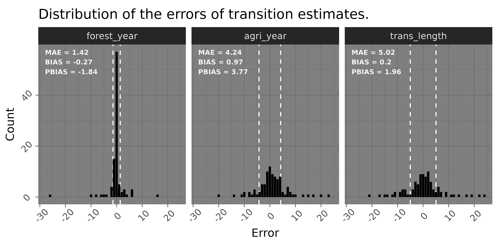
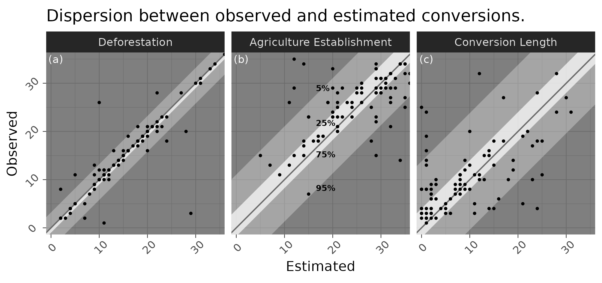

\introduction[Introduction]

In the last decades, the Amazon biome have been submitted to strong changes, the advance of agricultural areas over native forests is shaping a new landscape in the region.
The most common pattern of transitions from natural forest formations to agriculture sites, is the initial process of deforestation, followed by the establishment of pasture, where extensive livestock production takes place, until its replacement to agricultural activities.
This process can take several decades to be accomplished, or even less than one year, in which it may be considered as a direct transition from forest to agriculture.

Land cover transitions can cause important impacts on ecosystem properties [@Nunes2022].

This project aims to characterize and quantify the length of the transitions from forest formations to agriculture in the Amazon.

# Methods

The estimations of transition from forest to agriculture were performed for the Amazon biome region, as defined by the Brazilian Institute of Geography and Statistics (IBGE), in 2019.
Transitions were calculated using land use and land cover classification data from MapBiomas [@Souza2020], which ranges from 1985 to 2021, at a spatial resolution of approximately 30 meters.

Transition length was calculated pixel by pixel, by performing the following steps:

1.  Load raster and extract valid values into a table;

2.  Calculate the year of first occurrence of a non-natural LULC class for each pixel;

3.  Calculate the first year of "Forest Formation" LULC class after the year calculated in step 2, for each pixel;

4.  Classify rows as "before" or "after" the occurrence of the year calculated in step 3, for each pixel;

5.  Calculate the last year of "Forest Formation" within the rows classified as "before", for each pixel;

6.  Calculate the first year of any agriculture type class within the rows classified as "before", for each pixel;

7.  Calculate the difference between years from items 5 and 6 to get the LULC transition length in years, for each pixel;

# Description of data collection

We chose two ways to store and share the data.

-   One is to store the data from all three tables in three sets of Parquet files, in a structure of folders and sub folders;

-   The other is to convert the "trans_length.parquet" tables back to raster files.
    Raster files are useful to efficiently store spatial data, calculate areas, operate in relation to vector objects and perform data summaries, and it is also a very accessible format;

The new raster files are created based on the tiles downloaded from GEE (which are in the path "./data/raw_raster_tiles/"), using their extent values and its number of rows and columns (located on the "./data/trans_tabular_dataset/tiles_metadata.parquet" file).
For each tile file from "./data/raw_raster_tiles/", a set of new raster files are created based in the number of agriculture cycle ("agri_cycle") found in the tables, resulting in one raster for each agriculture cycle.
Each new raster file contains 6 bands:

-   Band 1 = "agri_code" (The agriculture class code that resulted from the transition);

-   Band 2 = "forest_year" (The last forest year before the transition, can be interpreted as the deforestation year);

-   Band 3 = "agri_year" (The first year of the agriculture establishment, being the end of the transition);

-   Band 4 = "trans_length" (The length in years of the transition from forest to agriculture);

-   Band 5 = "trans_cycle" (The number of the transition cycle in which the transition occurred);

-   Band 6 = "forest_type" (The type of the forest that suffered the transition);

The new raster files are saved in the path "./data/trans_raster_tiles/".

To facilitate the use of these new raster files, we also merged all the raster of each agriculture cycle into a single mosaic, which are saved in the path "./data/trans_raster_mosaic/".

# Results and discussion

The transition calculations shows that between 1985 and 2021, 64874 squared kilometers of forests were converted to agriculture, in the Brazilian Amazon biome.
The length of the transitions can go from 1 to 36 years, in which transitions closer to 1 year are considered as fast transitions, and transitions closer to 36 years are considered as slow transitions.
Transitions of 1 year are considered as "direct" transitions, where there were no presence of pasture before the establishment of agriculture, out estimations shows that around 9.2 % of the transitions are considered as "direct".

## Transition patterns

Transitions from forest to agriculture can be found in almost every region in the Amazon, but is mostly concentrated in clusters, specially in the south and east of the biome, in the states of Mato Grosso, Pará and Maranhão (Figure \@ref(fig:map-plot)).

```{r map-plot, out.width = "17cm", fig.pos = "h", echo = FALSE, fig.cap = "Map of distribution of transitions from forests to agriculture in the Brazillian Amazon biome. The hexagonal cells represent the most common transition length, and do not reflect the amount of area of transitions inside a cell. Transitions are concentraded in the south (Mato Grosso state), and in the east (Pará and Maranhão states). The transition length ranges from 1 (blue tones) to 36 years (pink tones), and clusters of fast transitions (transitions closer to 1 year) can be discerned from clusters of slow transitions (transitions closer to 36 years). The histogram located in the bottom left shows that fast transitions are more common than slower transitions. The zoomed map in the bottom right shows the results in finer resolution, where it is possible to observe different transition lengths between properties."}



```

Well defined clusters can be observed in the map created with aggregated transition length data (Figure \@ref(fig:map-plot)), slow transition areas tend to concentrate in specific regions in the Amazon biome, while fast transitions seem to have a wider distributions, but also tend to form clusters.
However, this pattern does not hold completely when observing the data at its original scale (Figure \@ref(fig:map-plot)), where areas with different transition lengths are mixed between each other.
When observing at the original scale, we could not spot any well defined pattern or direction of the occurrence of faster to slower transitions (Figure \@ref(fig:map-plot)).

Other studies investigating patterns of transitions in the Amazon also found the formation of clusters of patterns, although there is a big heterogeneity at larger scales [@MullerHansen2017].

The data can be analysed year by year, and also be separated by primary and secondary forests being converted to agriculture (Figure \@ref(fig:transbar-plot)).

```{r transbar-plot, out.width = "17cm", fig.pos = "h", echo = FALSE, fig.cap = "Transition area per year and transition length. The bars represent the total amount of area at some state of the transition for each year. The color gradient in each bar represents the transition length related to a deforestation or a agriculture establishment event. Blue tones represents fast transitions (transitions closer to one year), pink tones represents slow transitions (transitions closer to 36 years). Transition events were separated by deforestation of primary forests (a) and secondary forests (c), and the subsequent  agriculture establishment of primary forests (b) and secondary forests (d). TODO: add labels for important years hwere public policies took place."}



```

The deforestation area of primary forests increased largely from 1985 to 2002, which was followed be a steep decrease until 2007, when the deforested areas being converted to agriculture reached a stable rate.
From 1985 to approximately 1995, most of deforested areas suffered a slow transition, mostly were higher than 10 years, after this period, fast transitions started to become more common, specially from 2001 to 2003.

Agriculture establishment over areas of primary forests peaked in 2005 and 2013.
Despite similar rates between both years, their transition lengths differ greatly, in 2005 most of the transitions were faster than 10 years, while in 2013 the great majority of transitions were slower than 10 years.
The year of 2003 marked a change in the transition length of establishment of agriculture areas, after this year, most of the transitions happened in areas deforested at least 10 years before.
Even after the decrease of deforestation after 2002, agriculture areas are expanding over lands where deforestation happened before 2002.
However, after 2018, a sudden drop of agriculture establishment rate happened.

In 2006, the Brazilian Association of Vegetable Oil Industries (BIOVE) and the National Association of Cereal Exporters (ANEC) committed to avoid commercialization of soy grains harvested from areas deforested after 2006.
Our estimates of transitions show a decrease of deforested areas to be converted to agriculture after 2007, where it reached minimal values (Figure \@ref(fig:transbar-plot).a).
After 2006, agriculture establishment over deforested primary forests suffered a decrease, which stayed relatively stable until 2012, where a steep increase occurred, however, the new areas being occupied by agriculture were mainly over areas that were cleared more than a decade before (therefore, before 2006) (Figure \@ref(fig:transbar-plot).b) This shows that agriculture expansion did not halt after the soy moratorium, producers started expanding in old cleared areas.
Expansion of agriculture areas also expanded over cleared areas of secondary forests in 2012, but with an important amount of fast transitions.
The causes of the increase of agriculture establishment areas can be numerous, one main driver was the approval of a new Forest Code, in 2012, which is considered to have undermined the environmental protection [@Kroger2017; @Pereira2019].

The transition length patterns across years can change significantly between different states (Figure \@ref(fig:transridge-plot)).

```{r transridge-plot, out.width = "17cm", fig.pos = "h", echo = FALSE, fig.cap = "Transition length patterns inside states that belongs to the Amazon biome."}



```

The state of Amapá presented fast transitions along all the time series, where slow transitions are not as common.
In contrast, Acre shows a majority of slow transitions, in which only 2021 showed more fast transitions.There are three states where the pattern of transitions length across time are alike, Mato Grosso, Pará and Rondônia presented more fast transitions from 1995 to 2005, after this period, slow transitions became more common with time, until around 2015, where the occurrence of fast transitions were the majority again.

## Validation

When analyzing the errors from the transition length estimates, we observe that the year of deforestation shows the least amount of errors (Figure \@ref(fig:errorbar-plot)).
The MAE of the deforestation year is of 1.42 years, and the error shows a bias towards underestimation.
The year of the agriculture establishment and the transition length estimates showed larger errors when comparing with visual inspection.

```{r errorbar-plot, out.width = "17cm", fig.pos = "ht", echo = FALSE, fig.cap = "TODO: Add title."}



```

```{r errorscatter-plot, out.width = "17cm", fig.pos = "ht", echo = FALSE, fig.cap = "TODO: Change line showing MAE to shaded areas showing quantiles of the errors. Add title."}



```

## Qualitative assessment

\conclusions[Conclusions]
